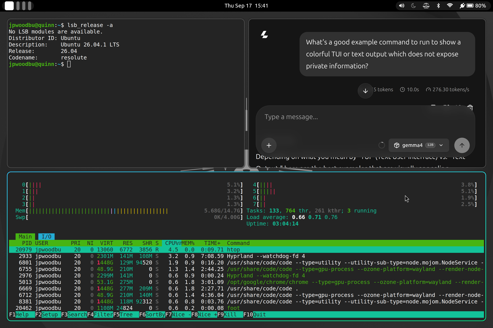
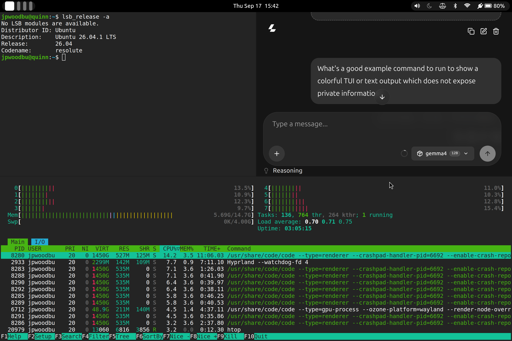
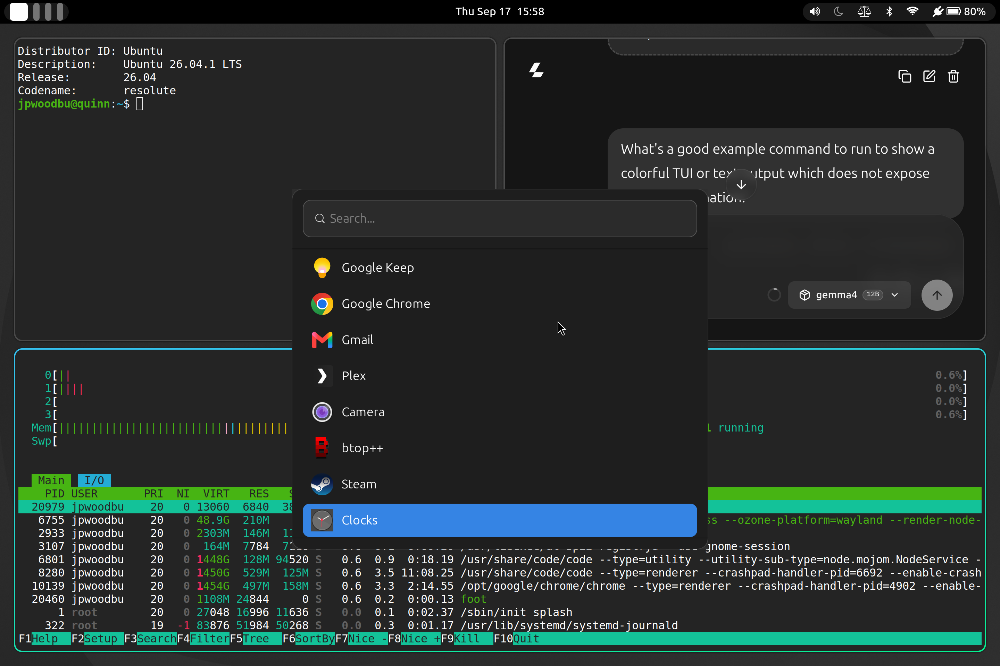
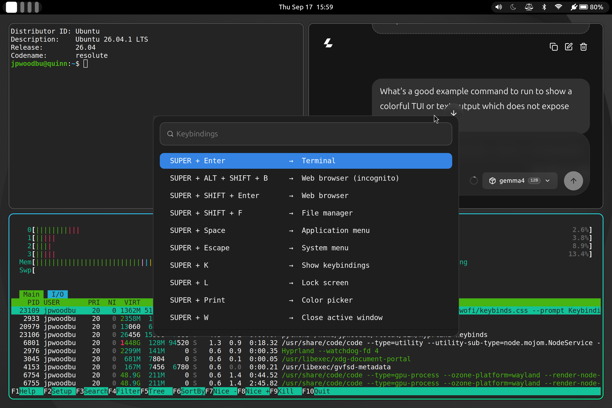
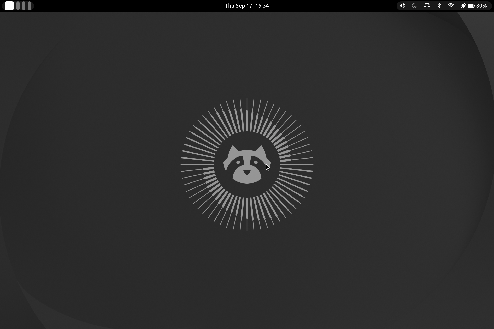

# hypr-stock-ubuntu

This is a guide for setting up [Hyprland](https://hypr.land/) on
[Ubuntu](https://ubuntu.com/) 26.04, made with the following goals:

* Stock-native: Use only packages from the stock Ubuntu repos
* Non-invasive: Coexist with the already installed desktop environment
* Inspectable: Small config files and scripts
* Low surface area: Configs only in your homedir with minimal exceptions
* [Omarchy](https://omarchy.org/) hotkeys: Use the same keybindings as Omarchy

This guide aims to make it trivial to try out Hyprland on Ubuntu without
disrupting your existing setup. And since the included config and scripts are
small, it should be easy to see how it works and further customize it.

Other ways to get Hyprland running on Ubuntu worth considering:

| Approach | Package Source | Coexistence with stock setup | Relative Footprint |
| :--- | :--- | :--- | :--- |
| [JaKooLit](https://github.com/JaKooLit/Ubuntu-Hyprland) | PPAs + GitHub releases | ❌ Severe breakage risk | Large |
| Community PPAs*| PPAs | ⚠️ Moderate risk | Varies |
| Source compile | Built yourself | ⚠️ Library collision risk | Large** |
| Nix on Ubuntu | Nix flake / built yourself | ✅ No risk | Large
| **hypr-stock-ubuntu** | Stock Ubuntu | ✅ No risk | Small |

_*Not needed with Ubuntu 26.04, but included for historical comparison._

_**Large if you include the footprint for running the build._

If you really like Hyprland and want to use it in a first-class sort of way, I
recommend trying out [Omarchy](https://omarchy.org/), although I think this
setup is good enough for me to use for the long term.

## Quick Start

Install the packages:
```sh
sudo apt update && sudo apt install hyprland hypridle hyprlock hyprpaper hyprpolkitagent hyprpicker waybar wofi swayosd foot wlsunset jq fonts-font-awesome brightnessctl playerctl wl-clipboard git
```

Clone this repo to bring in copies of the needed config files and scripts:
```sh
git clone https://github.com/jpwoodbu/hypr-stock-ubuntu.git
```

Copy the files into their canonical paths:
```sh
cd hypr-stock-ubuntu/dotfiles
mkdir -p ~/.local/bin
mkdir -p ~/.config
cp -i bin/* ~/.local/bin
cp -ir foot hypr waybar wofi ~/.config
```

Here are the few changes needed under `/etc`:
* In `/etc/xdg/swayosd` set `ignore_caps_lock_key = true` since caps lock is
  rebound to be an additional `SUPER` key in my `hyprland.conf`.
* In `/etc/systemd/logind` set `HoldoffTimeoutSec=0s`. This will not interfere
  with GNOME (KDE not tested) as GNOME takes over this functionality from
  systemd completely. Without this change, your Hyprland session will not
  suspend or **lock** if you close the lid on the machine within 30s of a wake,
  reboot, or power on.

Reload `systemd-logind`:
```sh
sudo systemctl reload systemd-logind
```

Logout and log back in, choosing the Hyprland session option from the gear icon
in the bottom right. The first thing you should do when logging in is try the
`SUPER + K` hotkey (i.e. `WINDOWS + K`) to bring up the list of keybindings. 

## Packages and how each one is used

| Package | Description |
| :--- | :--- |
| `hyprland` | The compositor; the star of the show. |
| `hypridle` | Manages timers for when to dim the screen, lock the session, and suspend the machine when the user is idle. It also talks with `systemd` to make sure the session is locked when the machine is suspended. |
| `hyprlock` | Screen-lock app. It locks the session and displays an authentication prompt to unlock it. |
| `hyprpaper` | Manages the background wallpaper. |
| `hyprpolkitagent` | Shows an authentication pop-up dialog box when root privilege is needed. |
| `hyprpicker` | Used with keybinding for copying pixel hex colors. |
| `waybar` | Displays a status bar across the top of the screen. |
| `wofi` | Displays menus for things like launching applications. |
| `swayosd` | Shows an on-screen-display for things like brightness and volume. |
| `foot` | Terminal program which works well with Hyprland; e.g. no title bar. |
| `wlsunset` | Changes the color temperature of the display; i.e. a night light. |
| `jq` | Parses the output from Hyprland tools inside some of the included scripts. |
| `fonts-font-awesome` | Provides icons for Waybar and the system menu. |
| `brightnessctl` | Used with keybindings to control display brightness. |
| `playerctl` | Used with keybindings to control media playback. |
| `wl-clipboard` | Wayland clipboard CLI. Used with the screenshot keybinding. |
| `git` | Only needed to clone this repo. |

## Scripts and how each one is used

| Script | Description |
| :--- | :---|
| `hyprland-keybinds` | Shows a dynamic menu of keybindings based on the running Hyprland config. |
| `hyprland-logout` | Tries to gracefully shutdown session processes in the right order on logout.
| `hyprland-window-pop` | Manages the logic of popping out windows (`SUPER + O`).
| `nightlight-status` | Tells the nightlight icon in the Waybar whether the nightlight is on or off. |
| `nightlight-toggle` | Toggles the nightlight on/off. Used by the Waybar and in a keybinding.
| `system-menu` | Shows a menu of actions like lock, suspend, reboot, etc.

## Extras

### Making Chrome "installed" web apps look better

If you don't want to see a title bar in your installed web apps, go into
`~/.local/share/applications`, find the `.desktop` file for the installed web
app and on the `Exec` line, add the `--app="<URL>"` flag to the command line.
For example, if you installed Discord, run `grep -il discord *` to find the
right file, open it, and add `--app="https://discord.com/app"

### Google Calendar integration

Clicking on the clock in the status bar will try to open Google Calendar by
running `gtk-launch google-calendar.desktop`. That works for me because I
clicked the button in Chrome to install Google Calendar while having it loaded
in a browser tab. I then went into `~/.local/share/applications` and renamed the
`.desktop` file Chrome created to `google-calendar.desktop`.

## Screenshots

Windows with borders with the active window highlighted



Windows without borders



Application launcher



Keybindings search



An empty workspace



## Known Issues

### No Bluetooth controls from the Waybar

Using the GNOME control center to manage things like WiFi and audio is 
functional, if clunky, but the Bluetooth controls from the GNOME control center
do not work when in a Hyprland session.

## FAQ

* [Why Hyprland?](#why-hyprland)
* [Why not just run Omarchy?](#why-not-just-run-omarchy)
* [Why is it important to coexist with other desktop environments?](#why-is-it-important-to-coexist-with-other-desktop-environments)
* [Why use Omarchy hotkeys?](#why-use-omarchy-hotkeys)
* [Why is $x Omarchy hotkey missing?](#why-is-x-omarchy-hotkey-missing)
* [Why not use Universal Wayland Session Manager?](#why-not-use-universal-wayland-session-manager)
* [Why are you opening the GNOME control center from the Waybar?](#why-are-you-opening-the-gnome-control-center-from-the-waybar)

### Why Hyprland?

I got a taste of Hyprland when trying out [Omarchy](https://omarchy.org/) and
really enjoyed it.

### Why not just run Omarchy?

I've been a long-time Debian and Ubuntu user and I wasn't ready to switch just
yet. And while I like the vast of majority of the Omarchy setup, there were a
few things I didn't want to bring over to my system.

### Why is it important to coexist with other desktop environments?

I like GNOME. I might end up going back to GNOME eventually (although the more I
use Hyprland the less likely that seems). I want to be able to switch back and
forth between Hyprland and GNOME sessions and I expect others, also new to
Hyprland, may want that too.

### Why use Omarchy hotkeys?

I think their [hotkeys](https://omarchy.org/manual/hotkeys/) are
well-thought-out. Since I might end up eventually switching to Omarchy, it makes
sense to stick to (a subset of) their bindings.

### Why is $x Omarchy hotkey missing?

Most likely, I've not yet needed it so I haven't added it. I plan to eventually
migrate every hotkey from Omarchy that is generally compatible with this setup.

### Why not use Universal Wayland Session Manager?

When I tried to integrate the `uwsm` package, it interfered too much with the
existing GNOME setup. IMO, fixing that would have required some inelegant
systemd configuration to conditionally start certain services only when using
Hyprland.

It also didn't fully address the problem I was hoping it would: graceful logout.
Calling `uwsm stop` alone doesn't give applications enough time (e.g. Chrome)
before the Wayland socket drops. A dedicated logout script was still necessary.
This is something GNOME has issues with too, at least for Chrome.

### Why are you opening the GNOME control center from the Waybar?

It was easy and functional aside from the Bluetooth controls, which I don't
usually need. A _Quick Controls_ style widget like GNOME has would be neat, but
I've not yet looked into it.